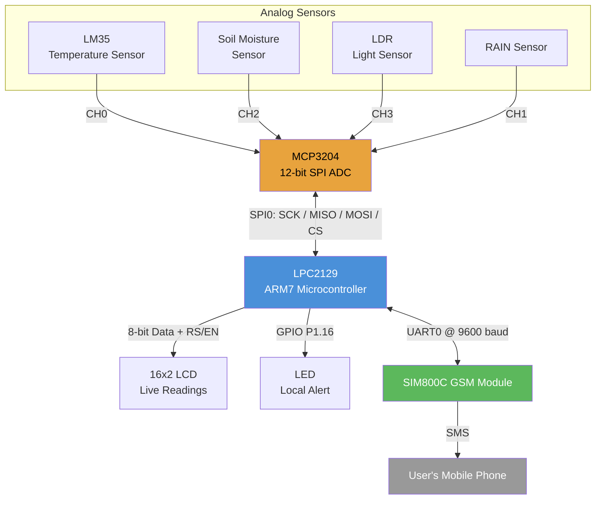

# Real-Time Weather Monitoring System with SMS Alerts

An embedded weather station built on the **LPC2129 (ARM7TDMI-S)** microcontroller. It continuously monitors temperature, soil moisture, Rain-sensors for climate change detection, and ambient light level, displays live readings on a 16x2 LCD, and sends an SMS alert via GSM whenever any parameter crosses a critical threshold.

## Block Diagram



## Description

The system reads four environmental parameters and reacts to abnormal conditions in real time:

| Parameter | Sensor | Interface | Alert Condition |
|---|---|---|---|
| Temperature | LM35 | MCP3204 CH0 (analog) | > 40°C |
| Soil Moisture | Resistive soil sensor | MCP3204 CH2 (analog) | < 30% moisture |
| Light Level | LDR | MCP3204 CH3 (analog) | Day/Night status |
| Climate-Change | FC-37 sensor | MCP3204(analog) | YES/NO |

Since the LPC2129 has no built-in ADC, all analog sensors are read through an external **MCP3204** 12-bit SPI ADC. The RAIN sensor outputs a clean digital HIGH/LOW, so it's read directly on a GPIO pin — no ADC channel needed.

**Normal operation:** the LCD cycles between two screens — Temperature/RAIN status, and Soil Moisture %/Day-Night — updating every few seconds.

**On threshold breach:** the onboard LED activates immediately, and the system sends a formatted SMS (via SIM800C over UART0, using standard AT commands) to a configured mobile number with the live readings and a "Take Necessary Action" prompt.

## Hardware Used

- LPC2129 ARM7 development board (12MHz crystal)
- MCP3204 12-bit SPI ADC
- LM35 temperature sensor
- Soil moisture sensor (analog)
- LDR (light dependent resistor)
- FC-37 (analog)
- 16x2 character LCD
- SIM800C GSM module
- LED (local alert indicator)

## Pin Mapping

| Function | LPC2129 Pin |
|---|---|
| SPI0 SCK | P0.4 |
| SPI0 MISO | P0.5 |
| SPI0 MOSI | P0.6 |
| MCP3204 CS (manual GPIO) | P0.7 |
| UART0 TXD (to GSM RXD) | P0.0 |
| UART0 RXD (from GSM TXD) | P0.1 |
| LCD Data (D0-D7) | P0.8 - P0.15 |
| LCD RS | P0.16 |
| LCD EN | P0.18 |
| RAIN Sensor Output | P0.17 |
| LED | P1.16 |

## Firmware Structure

```
main.c        - application logic: sensor polling, thresholds, alerts
spi.c/h       - SPI0 master driver
mcp3204.c/h   - MCP3204 ADC channel read
lcd.c         - 16x2 LCD driver (8-bit mode)
uart.c/h      - UART0 driver for GSM communication
gsm.c/h       - SIM800C AT-command SMS send/receive
types.h       - shared typedefs
defines.h     - bit manipulation macros
spi_defines.h - SPI register bit definitions
```

Built and tested in Keil µVision4.
